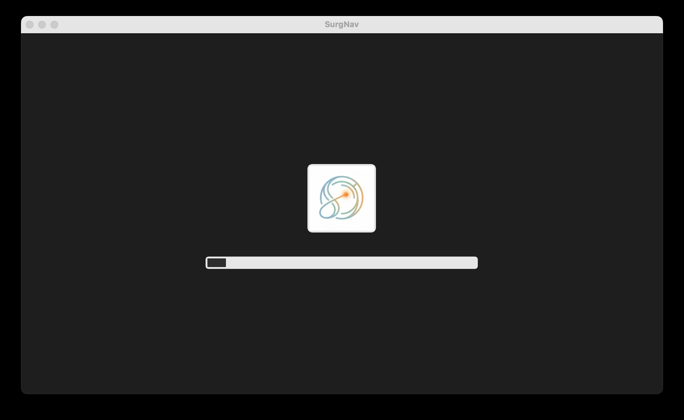
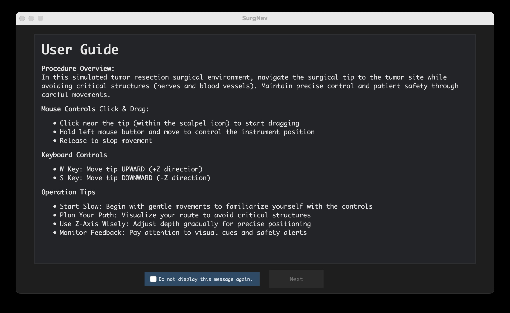
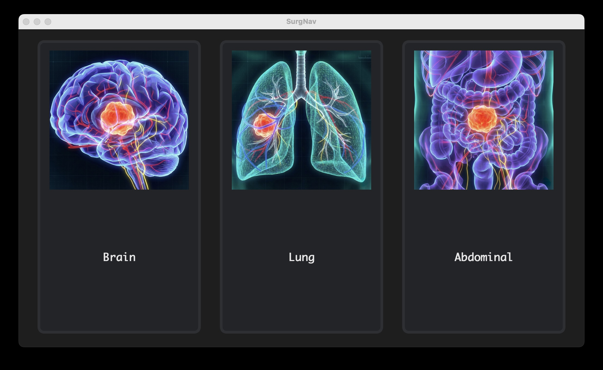
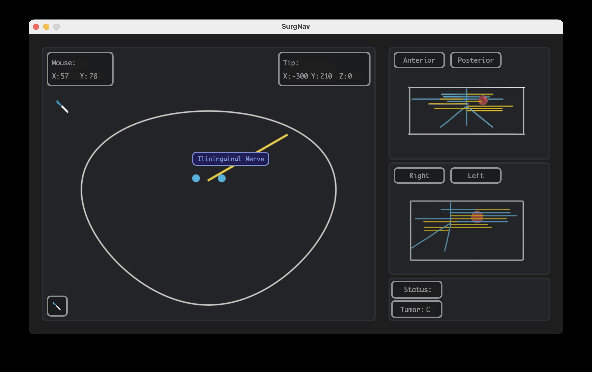
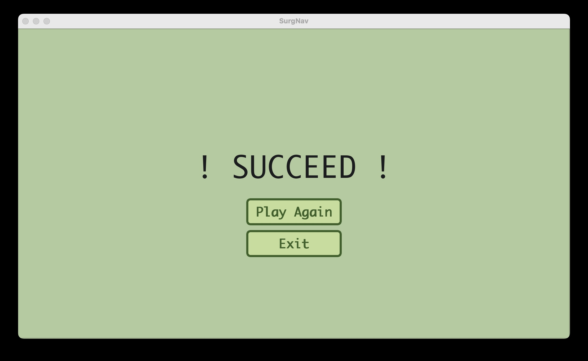
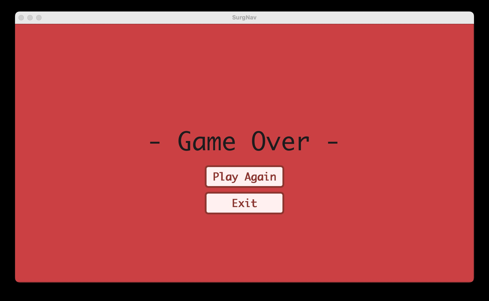

# SurgNav - Surgical Navigation UI Prototype
SurgNav is a Qt-based **surgical navigation interface prototype** designed for educational and experimental demonstrations of 3D anatomical visualization.  
The interface provides multi-view simulation pages, tumor localization aids, nerve/vessel visualization, mouse-position tracking, orientation control, and a tip-based interaction system for proximity detection.

---

## Features
- **Multi-page interface:** Includes Loading, User Guide, and Simulation pages for a structured workflow.
- **Three anatomical regions:** Each region contains a tumor and 20–30 nerves and vessels for realistic navigation context.
- **Orientation Control panel:** Allows toggling between anterior/posterior and left/right perspectives.
- **Real-time mouse tracking:** Continuously displays cursor coordinates for precise interaction feedback.
- **Tip Probe feature:** Activates only near the scalpel icon and determines proximity to anatomical structures, including tumor-reach validation.
- **Behavior Alert popup system:** Provides immediate feedback for boundary, action, or interaction events.
- **Dynamic Anatomical Labeling:** Displays the name of a nerve or vessel next to the cursor upon hover.
- **Slice navigation:** Navigate simulation slices quickly using W / S keyboard shortcuts.
- **Modern C++ and Qt architecture:** Built with C++17, Qt6, and CMake for modular and cross-platform development.

---

## Screenshots

| Loading Page | User Guide Page |
|-----------|------------------|
|  |  |

| Tumor Selection Page | Simulation Page |
|---------------|---------------|
|  |  |

| Success Page | Game Over Page |
|---------------|---------------|
|  |  |

---

## Demo Videos

[Watch Demo](demo/demo.mov)

---

## Downloads

| Platform | File | System Requirements |
|----------|------|-----------------|
| macOS | [SurgNav-macOS.zip](release/SurgNav_macOS.zip) | macOS 15.7.1+

---

## Technologies Used

- **Qt 6 (Widgets)**
- **C++17**
- **CMake**